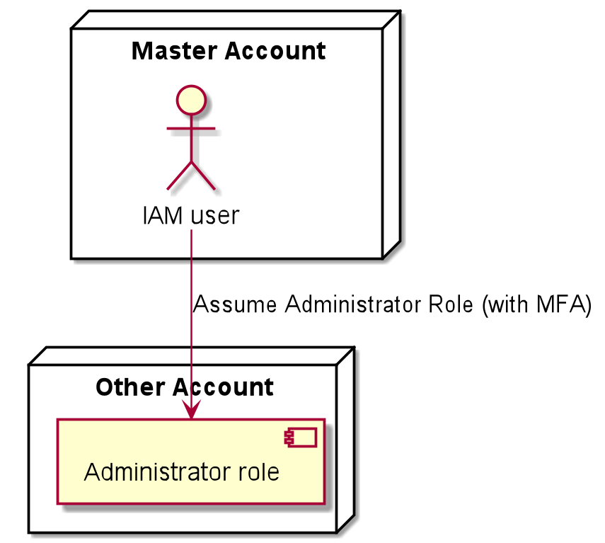

# Terraform STS role for account

This is a Terraform module for STS-based access roles. Roles are created within an AWS account to allow SSO users to perform actions against that account.

## Architecture

The most common use of this module is to:
- use organization master account IAM users as SSO user directory
- create roles (admin, developer, etc) in the account to be managed
- assign SSO users to appropriate roles depending on their access needs  
- enforce MFA for STS assume role operation for given role
- SSO user themselves should not have any additional privileges - all access should be granted using MFA-enforced STS assume role operation

  

